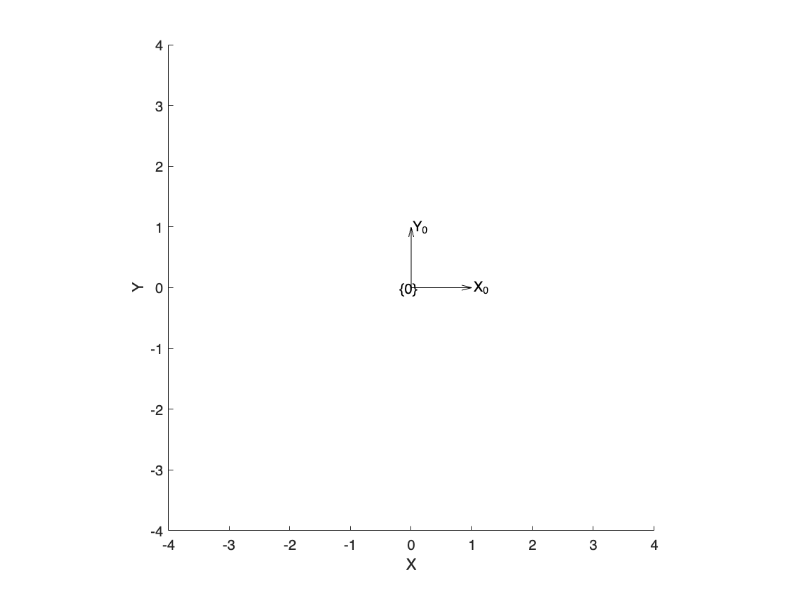
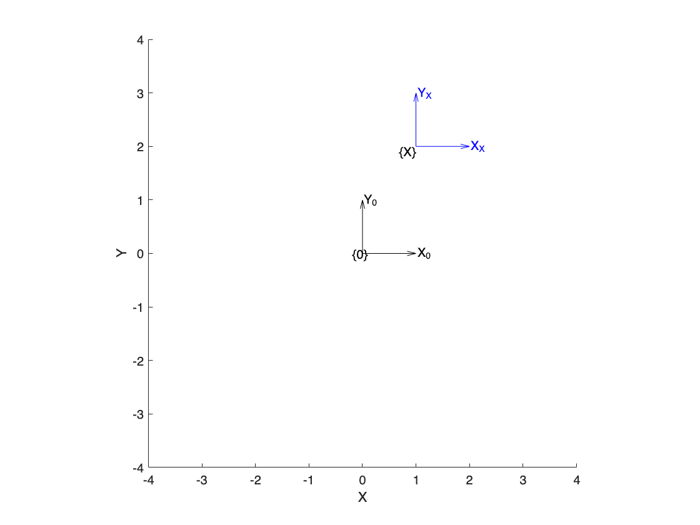
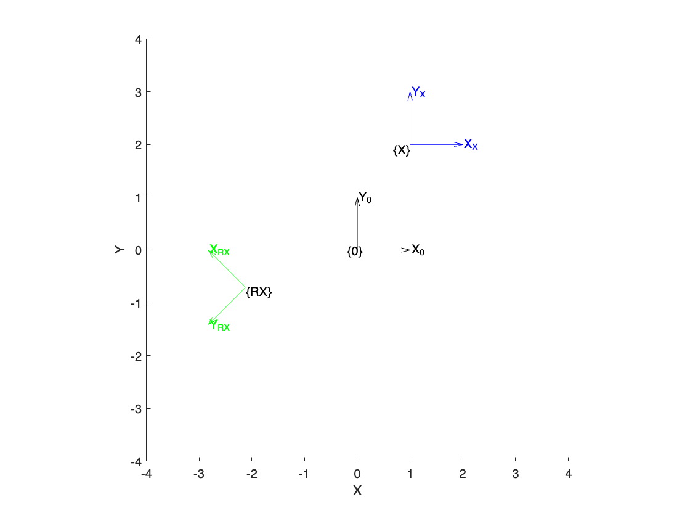
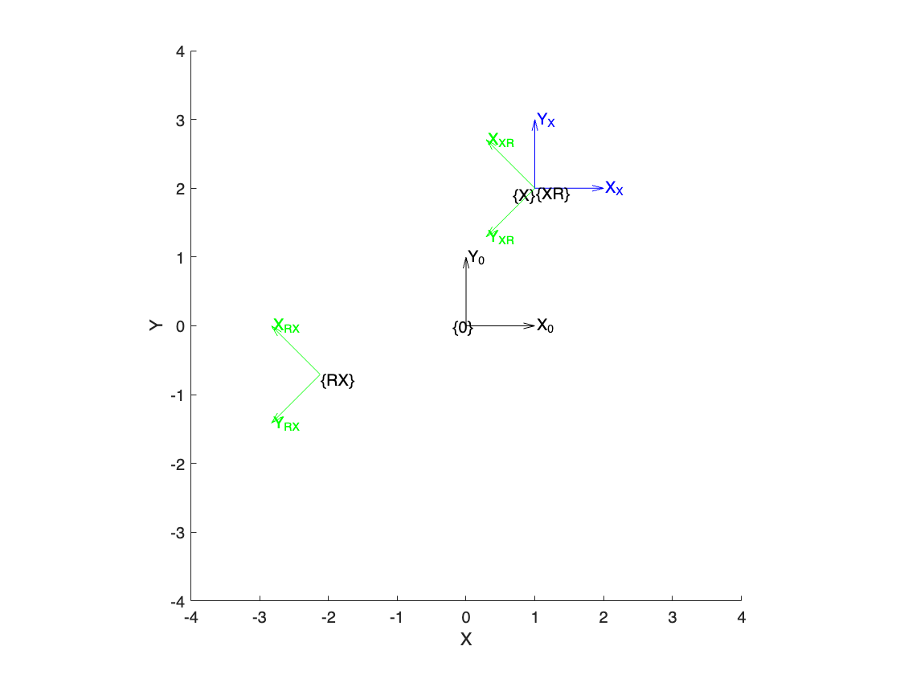
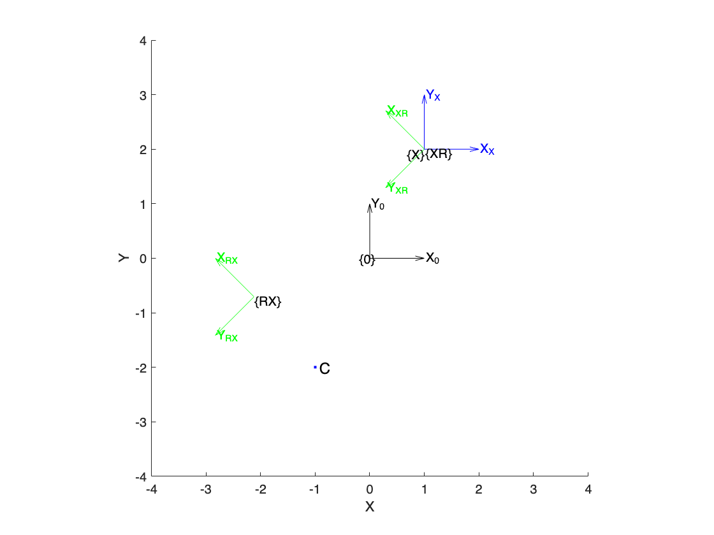
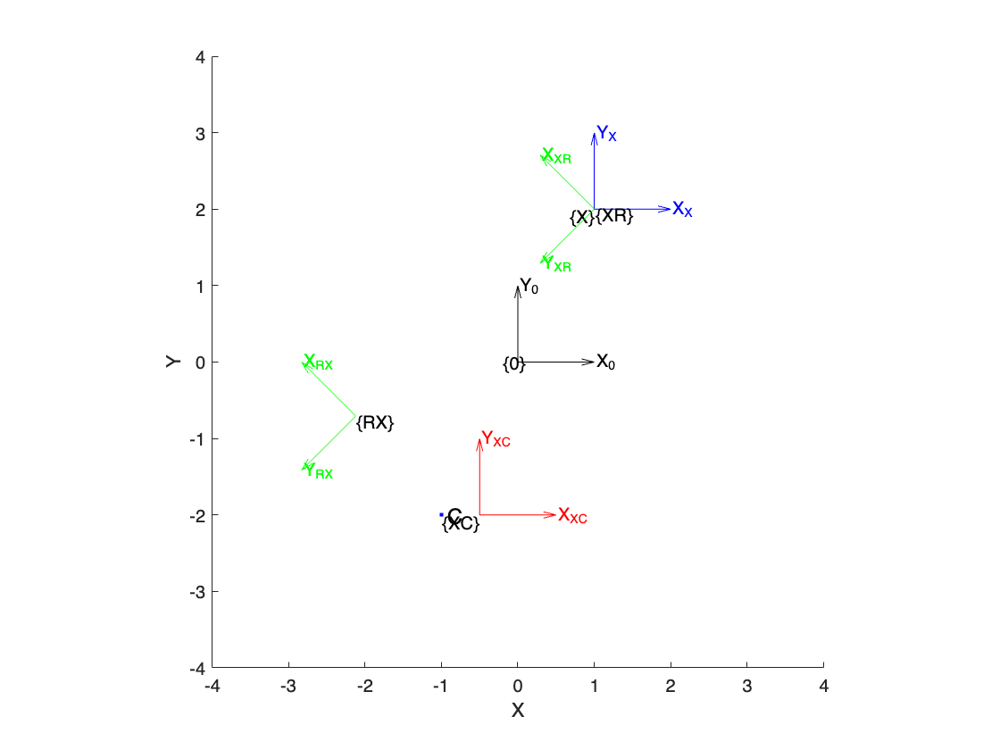
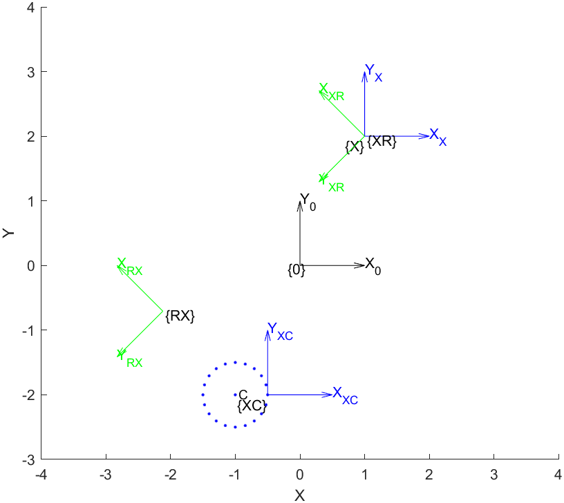
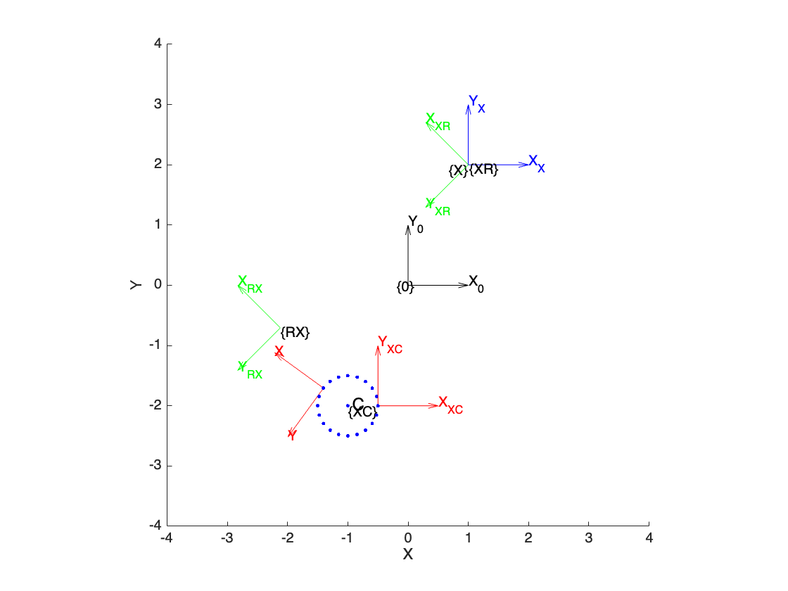

**Universidad de Costa Rica**


**Engineering Faculty**


**School of Computer Science and Informatics**


**Postgraduate in Computer Science and Informatics**


**Introduction to Robotics**


**Homework 01**


**Student: Kevin Trejos Vargas**


**ID: B26708**


**Cycle: II\-2024**


# Homework 01

This exercise is based on the topic "Position and Orientation Representation."


Execute steps 1 to 3 in MATLAB using the RVC3 toolbox utilized in class.

## **Step 1**
```matlab
clf;                                  % Clear the current figure window
T0 = trvec2tform([0 0]);              % Create a 2D transformation matrix at (0, 0)
plottform2d(T0,frame="0",color="k");  % Reference frame {0}
axis([-4 4 -4 4]);                    % Plot bounds for x and y
```



## **Step 2**
```matlab
TX = trvec2tform([1 2])               % Create a 2D transformation matrix at (1, 2)
```

```matlabTextOutput
TX = 3x3    
     1     0     1
     0     1     2
     0     0     1

```

```matlab
plottform2d(TX,frame="X",color="b");  % frame {X}
```



## **Step 3**
```matlab
TR = tformr2d(deg2rad(135));          % Create a 2D rotation matrix at 135°
TRX = TR*TX;                          % Combine translation with rotation matrices, first translates and then rotates around the origin
plottform2d(TRX,frame="RX",color="g");
```



## **Step 4**

Identify the vector that represents the origin point of the coordinate frames {X} and {RX} with respect to the coordinate frame {0}. Calculate the magnitude of each vector as $V=\sqrt{x^2 +y^2 }$ ; you can also use MATLAB's `norm()` function for this calculation.


Based on this information, clearly explain, step by step, what has happened to the frames {X} and {RX}.


Answer:


For the reference frame {X}, it is straightforward since it was simply displaced by one unit along the x\-axis and two units along the y\-axis. You can use the Pythagorean theorem for this purpose, as shown below:

```matlab
TX_displacement = sqrt(1*1 + 2*2)
```

```matlabTextOutput
TX_displacement = 2.2361
```

This is equivalent to computing the norm of the translation in the rotation matrix, which corresponds to the third column of the matrix. Since the example is in two dimensions, we only need the values for the x\-axis and y\-axis, corresponding to the first two rows. This is done as shown below:

```matlab
TX_translation = TX(1:2, 3)
```

```matlabTextOutput
TX_translation = 2x1    
     1
     2

```

```matlab
TX_displacement = norm(TX_translation)
```

```matlabTextOutput
TX_displacement = 2.2361
```

For the reference frame {RX}, we can perform the same procedure:

```matlab
TRX_translation = TRX(1:2, 3)
```

```matlabTextOutput
TRX_translation = 2x1    
   -2.1213
   -0.7071

```

```matlab
TRX_displacement = norm(TRX_translation)
```

```matlabTextOutput
TRX_displacement = 2.2361
```

In this way, as can be seen, since both underwent the same translation, the result of the norm is the same, equal to 2.2361.

##  **Step 5** 

Execute the following line of code and expand your answer from step 4 to explain what happens when plotting {XR}.

```matlab
TXR = TX*TR;                           % Rotate and then translate
plottform2d(TXR,frame="XR",color="g");
```



Answer:


In this case, since matrix operations are performed from right to left, the reference frame first rotates by 135° referenced to the origin (not translation, since it is at zero distance from the origin), and then translates by one unit along the x\-axis and two units along the y\-axis referenced to the origin. This positions it in alignment with the frame {X}, but rotated by 135° relative to it. Thus, its norm will also match that of the other reference frames, as shown below:

```matlab
TXR_translation = TXR(1:2, 3)
```

```matlabTextOutput
TXR_translation = 2x1    
     1
     2

```

```matlab
TXR_displacement = norm(TXR_translation)
```

```matlabTextOutput
TXR_displacement = 2.2361
```

## **Step 6** 

Run the code below to plot point C.

```matlab
C = [-1 -2];
plotpoint(C,".",'MarkerEdgeColor', 'b',label="C");
```



##  **Step 7** 

Write the code needed to create a reference frame with its origin located 0.5 units away from the point C in the x direction, with a rotation of 0 degrees.


Answer:


Knowing the coordinates of point C, it is possible to adjust it to become the new desired point, as shown below:

```matlab
XC = C                                 % Copy matrix C
```

```matlabTextOutput
XC = 1x2    
    -1    -2

```

```matlab
XC(1, 1) = XC(1, 1) + 0.5;             % Add a displacement to position (1,1)
XC = trvec2tform(XC)                   % Create a 2D transformation matrix at XC
```

```matlabTextOutput
XC = 3x3    
    1.0000         0   -0.5000
         0    1.0000   -2.0000
         0         0    1.0000

```

```matlab
plottform2d(XC,frame="XC",color="r");
```



##  **Step 8** 

Create an animation using the `plottform2d` function to plot the rotation of the coordinate frame {XC} from 0 to 360 degrees around point C. Plot in angle increments of 360/20 degrees and update every 0.5 seconds. Plot the origin point of each rotation as the animation progresses. The final result should look as shown in the figure below.





Answer:


According to the "Rotating a Coordinate Frame" section of the textbook, this can be accomplished with the following code:

```matlab
% Globals
radius          = 0.5;           % Radius of rotation
angle_increment = 360/20;        % Increment in degrees
pause_time      = 0.5;           % Time delay in seconds

% Create the initial position of XC with the offset
XC = C;                                  
XC(1, 1) = XC(1, 1) + radius;    % Add the displacement in x axis

% Plot the initial frame
TC = trvec2tform(C)*TR*trvec2tform(-C);
TX = trvec2tform(XC);
h  = plottform2d(TC*TX, framelabel = "XC", color = "r");

hold on;                         % Hold the plot to keep the existing frames
```



```matlab

while true
    % Plot the rotation for each angle increment
    for i = 1:20
        % Update the rotation matrix for the current angle
        TR = tformr2d(angle_increment * i * pi / 180);  % Create SE(2) matrix out of current rotation
        TC = trvec2tform(C)*TR*trvec2tform(-C);         % Rotates the frame around C
        
        % Update the plot
        result = TC*TX;
        plottform2d(result, handle = h);                % Handle makes the plot animation work

        % Plot the origin for each rotation
        origin = [result(1, 3) result(2, 3)];
        plotpoint(origin, ".", 'MarkerEdgeColor', 'b');
        
        pause(pause_time);                              % Pause to create the animation effect
    end
end
```
