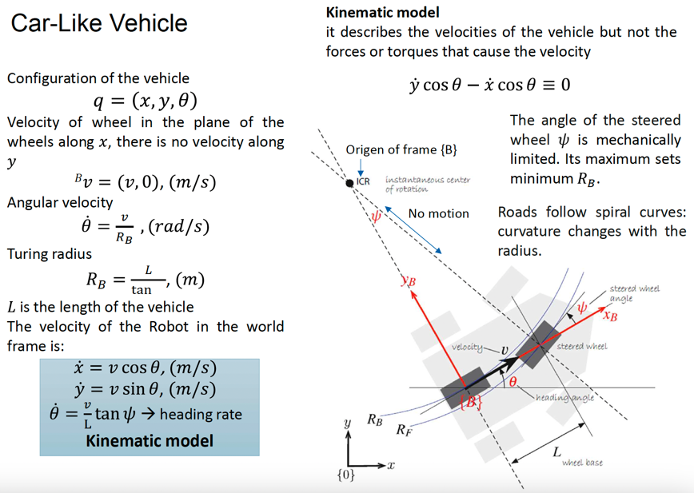
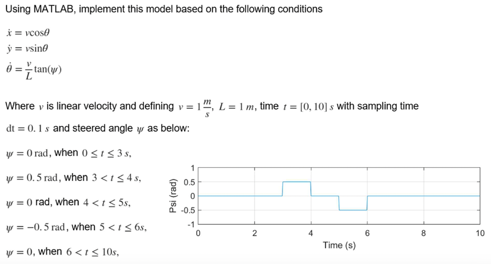
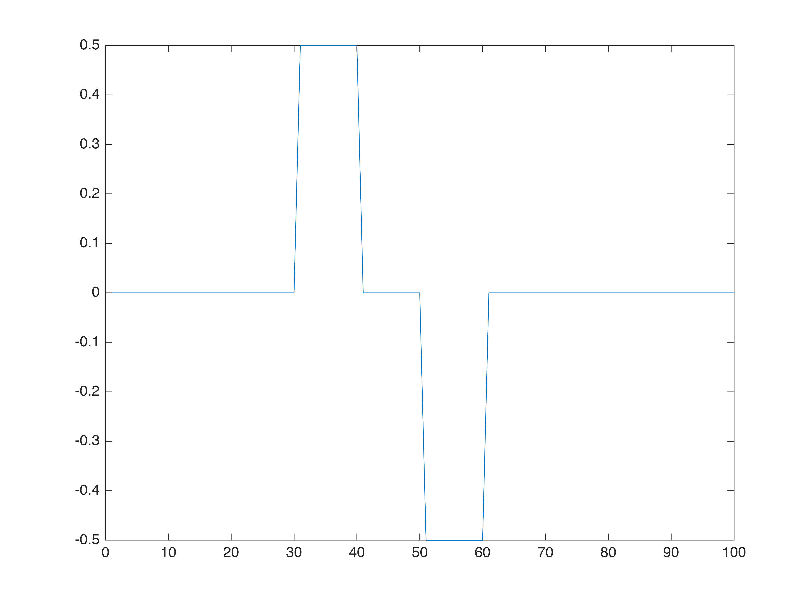
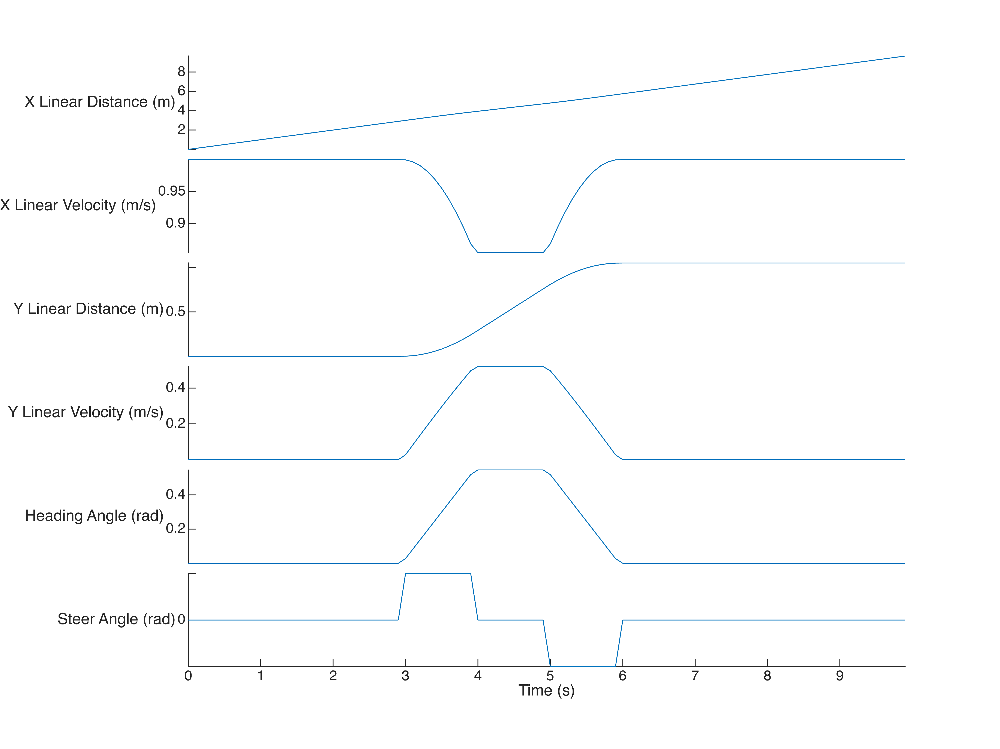

# Implementing the Kinematic Model of a Car\-Like Robot in MATLAB

The mobile robot model in a car\-like fashion can be described by its x and y velocities, and its angular velocity (aka heading rate), all of them with respect to the frame {0}. The mathematics behind it are shown below.





Given that model mathematical definition, the following example is requested to model.




# Global variables
```matlab
clear all; clc; clf;

linearVelocity = 1;         % v  = 1 m/s
linearDistance = 1;         % L  = 1 m
timeVector     = 0:0.1:9.9; % t  = Vector with step size of 0.1 between 0 and 10
deltaTime      = 0.1;       % dt = 0.1 s

```
# Define the steering wheel angle vector
```matlab
steerAngle          = linspace(0 , 0, 100);
steerAngle(:,31:40) = 0.5;  % rad/s
steerAngle(:,51:60) = -0.5; % rad/s
plot(steerAngle);
```


# Kinematic model
```matlab
% Obtaining theta out of theta prime
headingRate     = (linearVelocity/linearDistance).*tan(steerAngle); % Element-wise multiplication
headingAngle    = cumtrapz(headingRate*deltaTime);                  % Integrates to obtain angular displacement from angular velocity

% Obtaining y-displacement out of y-velocity
yLinearVelocity = linearVelocity*sin(headingAngle);
yLinearDistance = cumtrapz(yLinearVelocity*deltaTime);              % Integrates to obtain linear displacement from linear velocity

% Obtaining x-displacement out of x-velocity
xLinearVelocity = linearVelocity*cos(headingAngle);
xLinearDistance = cumtrapz(xLinearVelocity*deltaTime);              % Integrates to obtain linear displacement from linear velocity
```
# Plot the model
```matlab
clf;
% Transposes data, since stackedplot receives y-data only vertically
plot = stackedplot(timeVector, [xLinearDistance', xLinearVelocity', ...
                                yLinearDistance', yLinearVelocity', ...
                                headingAngle', steerAngle']);

% Adds plot labels
plot.XLabel = "Time (s)";
plot.DisplayLabels = {'X Linear Distance (m)', 'X Linear Velocity (m/s)', ...
                      'Y Linear Distance (m)', 'Y Linear Velocity (m/s)', ...
                      'Heading Angle (rad)', 'Steer Angle (rad)'};
```


