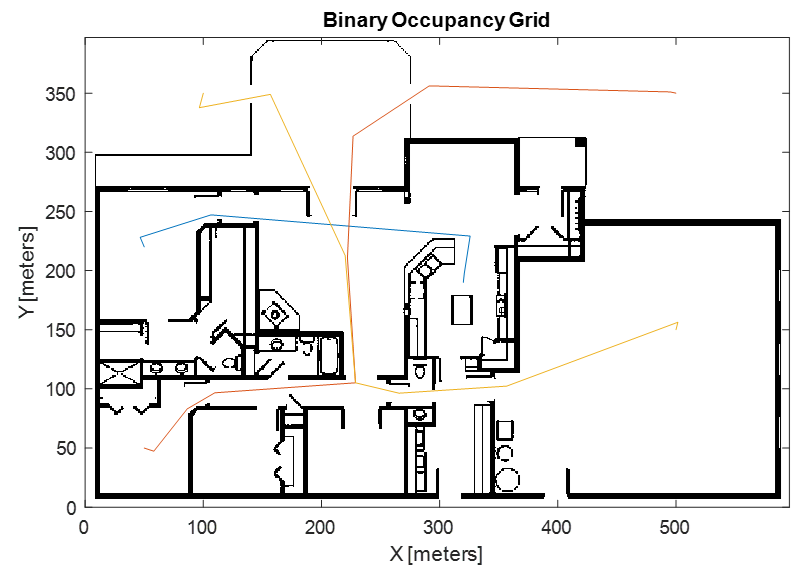
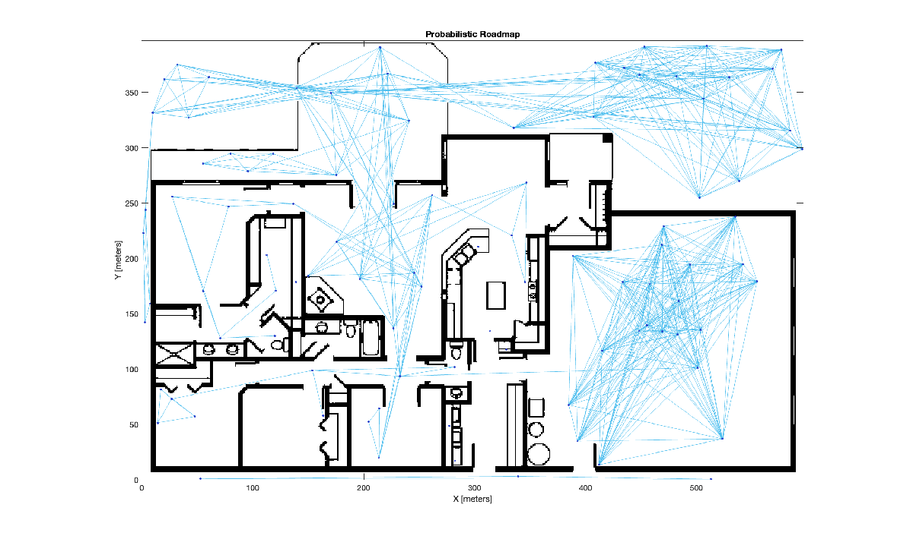
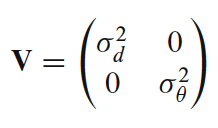
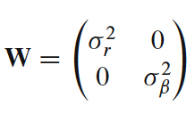
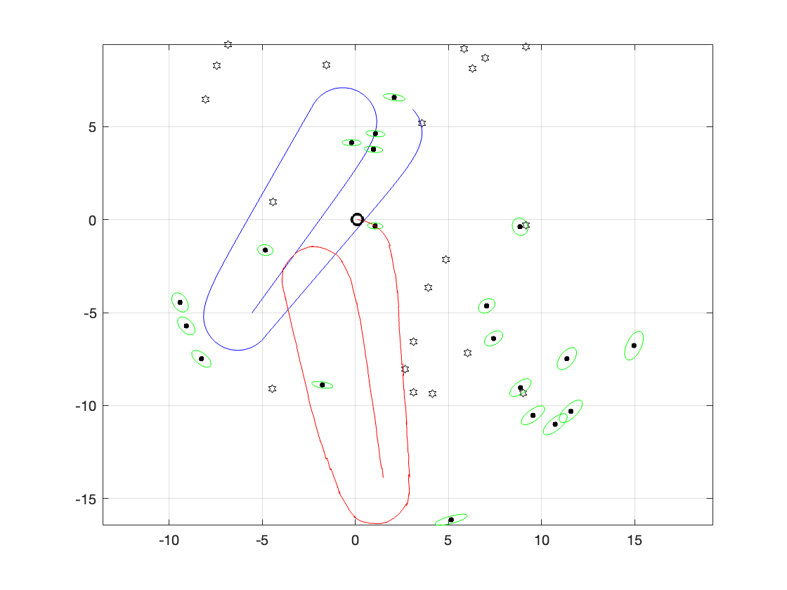
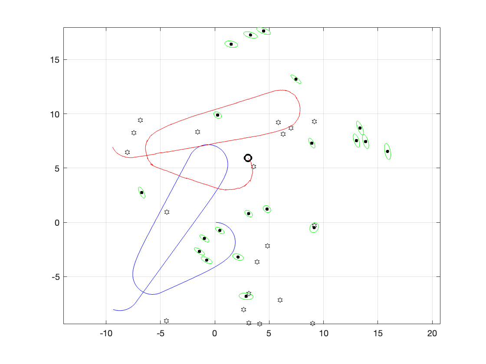
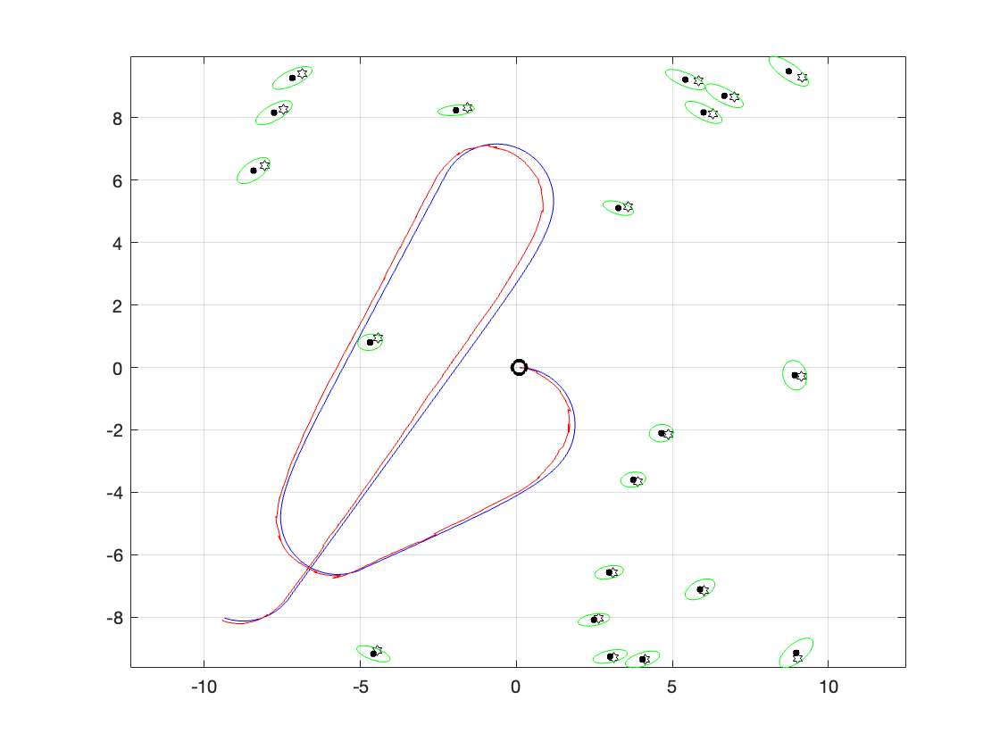

This laboratory project for the Introduction to Robotics course aims to apply knowledge related to the topics of 'Navigation', 'Localization', 'Kinematics', and 'Dynamics and Control'.

## Part 1 Navigation (4pts)

Use the RVC toolbox to load the floor map shown in the figure below. Then, using PRM based on exercise 5.5.2, find each of the paths shown in the figure. Keep in mind that there are three distinct paths, and the direction of movement follows from left to right according to the map. Your goal should be to find the minimum number of nodes that define the three paths. Your answer may vary from the figure below.    





*To load the floor map in question, the following code is used, taken from exercise 5.1.2.*

```matlab
load house
whos floorplan
floorMap = binaryOccupancyMap(flipud(floorplan));
figure; floorMap.show
```

*Subsequently, to find the indicated paths, the following code is used. It should be noted that the paths being sought are:*

1.  *Garden to Garage.*
2. *br3 to Driveway.*
3. *br1 to Kitchen.*
```matlab
rng(10) % obtain repeatable results
prm = mobileRobotPRM(floorMap)
prm.NumNodes = 6; % Minimum nodes required
r1 = []; r2 = []; r3 = [];
while size(r1, 1) == 0 || size(r2, 1) == 0 || size(r3, 1) == 0
    prm.show;
    r1 = prm.findpath(places.garden, places.garage);
    r2 = prm.findpath(places.br3   , places.driveway);
    r3 = prm.findpath(places.br1   , places.kitchen);
    prm.NumNodes = prm.NumNodes + 1;
end
fprintf('The minimum number of nodes is %d\n', prm.NumNodes - 1);
```

*Through this code, the desired paths have been obtained with only 95 nodes. See the following image for reference.*




## Part 2 Localization (4pts)

This part is based on exercise 6.2.3 EKF SLAM, on simultaneous mapping and localization. Create a map with reference points or landmarks.

```matlab
clear all; clf; rng(0) % obtain repeatable results
map = LandmarkMap(20, 10);
map.plot
```

Define V, review what was learned in the classes and the information provided in the book to briefly explain what V refers to.

```matlab
V = diag([0.1 deg2rad(1)].^2);
```

*V contains the uncertainty of the robot's odometry, in translation and rotation, in this case given as 0.1 meters and 1°, also known as the covariance matrix. This matrix is of the following form:*





Use the robot class to invoke the bicycle model and initialize its pose at q0 = (3, 6, \-45°). Create a random trajectory using RandomDriver.

```matlab
% Calling the robot
q0 = [3 6 deg2rad(-45)]
x_est0 = [0 0 0]
robot = BicycleVehicle(covar = V, q0 = q0);
robot.addDriver(RandomDriver(map.dim, show=true)); % random driver
```

Define a 'Lidar' sensor for landmark detection and define W. Explain what W refers to.

```matlab
W = diag([0.1 deg2rad(1)].^2);
sensor = LandmarkSensor(robot, map, covar = W, animate = true);
```

*W represents the uncertainty of the sensor, set to 0.1 m and 1°. It is also known as the sensor's covariance matrix, which is defined as shown below.*





*Invoke the Extended Kalman Filter (EKF) estimator by incorporating the robot and the sensor. Define P0 and explain what this vector refers to. Initialize the EKF estimator with the pose x\_est0 = \[0 0 0\].*

```matlab
P0 = diag([0.05 0.05 deg2rad(0.5)].^2);
ekf = EKF(robot,V,P0,sensor,W,[]);
ekf.run(500,x_est0=x_est0);
```

*P0 refers to the initial covariance of the robot's state, which is a 3x3 diagonal matrix.*


Plot the map, the actual path (blue), the estimated landmarks, and the path estimated by EKF (red).

```matlab
map.plot;          % plot true map
robot.plotxy("b"); % plot true path
ekf.plotmap("g");  % plot estimated landmarks + covariances
ekf.plotxy("r");   % plot estimated robot path
```

As a result, the blue and red graphs appear misaligned. Present the graph.





Swap the values of q0 and x\_est0, run the code, and present the graph.





Set q0 = x\_est0 = \[0 0 0\], run the code, and present the graph.





Explain what happens when these values are changed.


*What is happening is that the robot's actual state corresponds to q0, which is defined as \[3 6 deg2rad(\-45)\], meaning it starts at position x = 3, y = 6, with an angle of \-45°. However, the EKF SLAM is being fed with the assumption that the initial estimated state of the robot is \[0 0 0\], meaning it is assumed to be placed at the origin with zero rotation. When the SLAM algorithm begins to run, it starts from this assumption and performs its task, converging in trajectory and landmark identification, with the detail that it is not referenced to the robot's actual initial pose.*


*This does not mean that the algorithm doesn't work; it is simply a matter of referencing. In SLAM, it is not essential for the map and the estimated pose of the robot to be aligned with the absolute coordinates of the environment (like in GPS geolocation). What is important is that the generated map is useful for the robot’s relative navigation, and that the map and the path maintain a consistent relationship between them.*

## Part 3 Kinematics (4pts)

This part is based on exercise 7.3.1 on Inverse Kinematics. The idea is to use the robot 'abbIrb1600' and program a trajectory defined in the end effector's configuration space, calculate the joint configuration for each point in the trajectory, and simulate the robot's movement.


The code below shows an example for implementing the animation.


For this exercise, you are given full freedom to implement the trajectory of your choice. This trajectory should show the robot moving in at least three dimensions, not just in a plane as shown in the example.


As a recommendation, you can use the MATLAB app.

```matlab
inverseKinematicsDesigner
```

For the selection of key points such as the start and end, then use `trapveltraj` to generate the complete trajectory. Attach the MATLAB code used to show the solution.

```matlab
clear all
clf;
abb = loadrobot("abbIrb1600",DataFormat="row");
sol1 = [89.15 17.81 7.28 89.64 -89.23 -64.90 ]*pi/180;
sol2 = [-5.58 62.09 -118.78 -145.76 115.00 18.00 ]*pi/180;
waypts = [sol1(1,:)' sol2(1,:)'];
t = 0:0.02:2;
[q,qd,qdd] = trapveltraj(waypts,numel(t),EndTime=2);
r = rateControl(50);
for i = 1:size(q,2)
  abb.show(q(:,i)',FastUpdate=true,PreservePlot=false);
  r.waitfor;
end
```

*To determine the values to use instead of sol1 and sol2, the Inverse Kinematics Designer app was used. Once the robot was initialized, the configuration values of the end effector for each determined pose were displayed at the bottom of the application. Two points were selected in the environment to ensure movement along all three axes and were directly stored in sol1 for the start and sol2 for the end.*

## Part 4 Jacobian (4pts)

For this part, you can refer to exercise 8.3.1 and its explanation in the corresponding section of the book.


If the Jacobian is a square matrix, a robot configuration $q$ where its determinant $J$ is equal to zero $\det \left(J\left(q\right)\right)=0$ is described as singular or degenerate. Singularities occur when the robot is at maximum reach or when the axes of one or more joints align. This causes the loss of degrees of freedom of movement, which is the gimbal lock problem.


For the case of the PUMA robot, calculate whether the Jacobian is singular or not in its ready configuration with the vector qr.

```matlab
[puma, conf] = loadrvcrobot("puma");
J = puma.geometricJacobian(conf.qr, "link6")
det(J)
```

*After loading the PUMA robot and computing its determinant, it was determined that in this ready configuration, the PUMA robot is in a singularity, as the result was zero.*


Determine the rank of the Jacobian and explain what it means in this context.

```matlab
rank(J)
```

***Disclaimer****: The following analysis was largely taken from the book, as the case study is equivalent.*


*The rank of the Jacobian gives us an idea of the rank deficiency. Since the Jacobian is a 6x6 matrix, we can say that the deficiency is 6 \- 5 = 1, which, again directly from the book, means that one column is equal to a linear combination of the other columns. The Jacobian of this robot is as follows:*


 *0              0             0              0             0             0* 


 *0   \-1.0000   \-1.0000              0   \-1.0000             0* 


 *1.0000     0.0000    0.0000    1.0000    0.0000    1.0000* 


 *0.1500   \-0.8636   \-0.4318             0             0             0* 


 *0.0203    0.0000    0.0000             0             0             0* 


 *0    0.0203    0.0203             0             0             0* 


*In this case, it is noticeable that columns 4 and 6 are identical, which means that the movement of joint 4 or joint 6 results in the same velocity in the task space, making movement in one direction of the task space inaccessible.*


Consider a small variation in one of the joints represented by the vector qr:

```matlab
qns = conf.qr;
qns(5) = deg2rad(5)
```

 Calculate the Jacobian J.

```matlab
J = puma.geometricJacobian(qns,"link6");
```

Use resolved\-rate motion control to generate a velocity of 0.1 m/s along the z\-axis of the end\-effector and calculate the velocities in the joint space in rad/s. Can you determine if there is any joint that produces a high angular velocity?

```matlab
qd = inv(J)*[0 0 0 0 0 0.1]';
qd' % transpose for display
```

*The result of the previous code, which generates a velocity of 0.1 m/s along the z\-axis of the end\-effector, gives us the following list of velocities for each joint.*


 *\-0.0000   \-4.9261* ***9.8522*** *0.0000   \-4.9261   \-0.0000* 


*Here, it is noticeable that the third joint has a velocity nearly twice as high as the highest velocity of the other joints.*


Calculate the determinant of the Jacobian and the condition of the Jacobian matrix.

```matlab
det(J)
cond(J)
```

How do you explain the behavior of the joint velocity values in comparison to the velocity along the z\-axis, and what is the relationship with the determinant and condition value calculated?


*It is noticeable from the obtained values for the velocity of each joint for the given movement that there are joints, such as the third joint, that are overexerting. While only a movement of 0.1 m/s along the z\-axis was desired, this joint resulted in a movement of 9.8522 rad/s.*


*With the two previous lines, it was possible to determine that, although the determinant is no longer zero, it is still very close to zero, indicating that it is very close to a singularity, with a value of 1.5509e\-05.*


*Additionally, the condition of the Jacobian matrix can be computed, which gives us a relationship between the highest and lowest singular values of the matrix in question. When this result is very large, it indicates that we are close to a singularity. In this case, the value was 235.2498, which is very large and a strong indicator that we are near a singularity.*


*In the initial case, where the system was truly in singularity, the condition value of the Jacobian matrix was 9.9020e+17, a clear indicator by its size that the system was in a singularity.*


 

