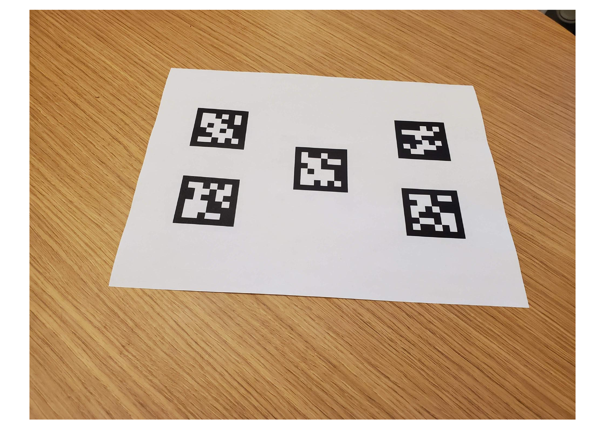
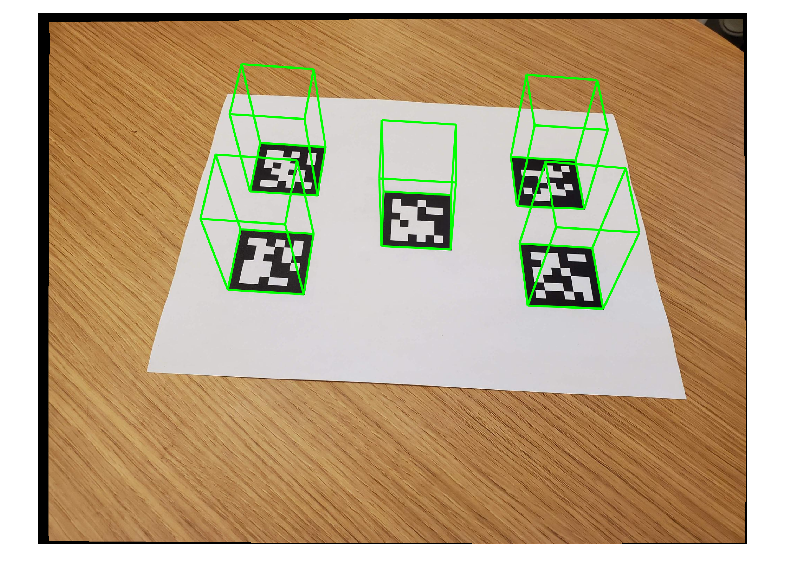

The following MATLAB code takes an image taken with an specific camera which we hold the intrinsics of it, and projects a set of prisms on it where the algorithm detected the placement of an AprilTag.

```matlab
scene = imread("aprilTag36h11.jpg");
imshow(scene);
```



```matlab

% Load camera intrinsics
data = load("camIntrinsicsAprilTag.mat");
intrinsics = data.intrinsics;

% Undistort the image using the camera intrinsics
scene = undistortImage(scene, intrinsics, OutputView="same");

tagSize = 0.04; % in meters
[id, loc, pose] = readAprilTag(scene, "tag36h11", intrinsics, tagSize);

[cubeWidth, cubeHeight, cubeDepth] = deal(tagSize);

% Define the vertices of the cuboid (before scaling the top face)
vertices = [ cubeWidth/2 -cubeHeight/2; 
             cubeWidth/2  cubeHeight/2;
            -cubeWidth/2  cubeHeight/2;
            -cubeWidth/2 -cubeHeight/2 ];

% Bottom face: 3D vertices at z = 0
bottomFace = [vertices zeros(4,1)];

% Top face: Keep x, y same, but scale z (depth) by factor depending on desired visual effect
topFace = [vertices cubeDepth*ones(4,1)]; % Start with no scaling on z

% Dynamically scale z (depth) based on the desired effect (can be adjusted)
depthScalingFactor = -1.5;  % Increase this to make top face "move" away from the camera
topFace(:, 3) = topFace(:, 3) * depthScalingFactor;

% Combine bottom and top face vertices into a single matrix
prismVertices = [bottomFace; topFace]
```

```matlabTextOutput
prismVertices = 8x3    
    0.0200   -0.0200         0
    0.0200    0.0200         0
   -0.0200    0.0200         0
   -0.0200   -0.0200         0
    0.0200   -0.0200   -0.0600
    0.0200    0.0200   -0.0600
   -0.0200    0.0200   -0.0600
   -0.0200   -0.0200   -0.0600

```

```matlab

% Initialize the augmented image
augmentedImage = scene;

% Loop through all detected poses of the AprilTags
for i = 1:length(pose)
    % Project the 3D vertices into 2D image coordinates
    imagePoints = world2img(prismVertices, pose(i), intrinsics);
    
    % Extract the 2D x and y coordinates from the projection
    projected2D = imagePoints(:, 1:2);
    
    % Insert the projected prism into the image
    augmentedImage = insertShape(augmentedImage, "projected-cuboid", projected2D, ...
        ShapeColor="green", LineWidth=6);
end

imshow(augmentedImage);
```


