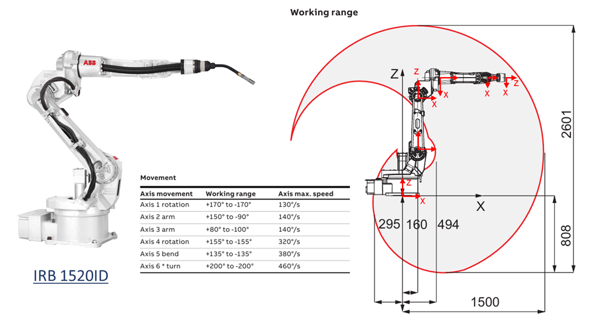
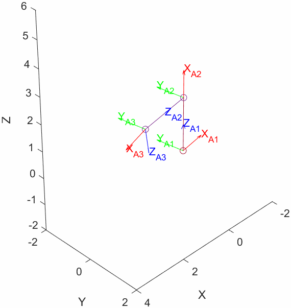

**Universidad de Costa Rica**


**Engineering Faculty**


**School of Computer Science and Informatics**


**Postgraduate in Computer Science and Informatics**


**Introduction to Robotics**


**Project 01**


**Student: Kevin Trejos Vargas**


**ID: B26708**


**Cycle: II\-2024**


This laboratory project for the Introduction to Robotics course aims to apply knowledge related to the topic "Representation of Position and Orientation" in the case of three dimensions.


Below is part of the data sheet information for the IRB 1520ID robotic arc welder system.


This documentation provides information on the 6 degrees of freedom of the robot and specifies the rotational angle limits for each axis following the ZYZ convention.


The student is required to:

-  Model and simulate the joints of this robot in MATLAB using coordinate frames. 
-  Simulate its links using lines connecting the origin points of each reference frame. 
-  The simulation should be performed in MATLAB using the toolbox provided for the course. This can be done using either Livescripts (\*.mlx) or MATLAB scripts (.m), depending on the student's preference. 
-  The code must be written in such a way that the joint rotations can be viewed as an animation, with the links following these rotations while maintaining connections to the origins of their respective frames. 
-  An example of how the simulation should look is shown in the animated GIF at the end of this statement. 
-  Submit the code with clear documentation in MATLAB and upload the file (*.mlx/*.m) to the virtual platform. 




[IRB 1520ID](https://search.abb.com/library/Download.aspx?DocumentID=ROB0214EN_G&LanguageCode=en&DocumentPartId=&Action=Launch)


Example of how the first three joints of the simulated robot should appear in MATLAB. The animation was created by changing the rotation angles of each reference frame simultaneously. Your solution may differ if, for example, you choose to animate each rotation in sequence. 




# Globals
```matlab
pause_time = 0.05;
offset     = 6;
axes       = [-30 30 -30 30 0 30];
A1b        = [-170 170];
A2b        = [-90 150];
A3b        = [-100 80];
A4b        = [-155 155];
A5b        = [-135 135];
A6b        = [-200 200];
A4toA3rot  = 90;
genGif     = false;

```
# Create an initial plot for each of the reference frames
```matlab
clf;

% Create and plot A1 reference frame
A1 = tformrz(A1b(1)*pi/180);
h1 = plottform(A1, frame = "A1");

% Plot bounds for x and y
axis(axes);

% Create and plot A2 reference frame
A2 = trvec2tform([0 0 offset])*tformry(A2b(1)*pi/180);
A2 = A1*A2;
h2 = plottform(A2, frame = "A2");

% Create and plot the vector from A1 to A2
hv2 = quiver3(0, 0, 0, A2(1, 4), A2(2, 4), A2(3, 4));

% Create and plot A3 reference frame
A3 = trvec2tform([0 0 offset])*tformry(A3b(1)*pi/180);
A3 = A2*A3;
h3 = plottform(A3, frame = "A3");

% Create and plot the vector from A2 to A3
hv3 = quiver3(A2(1, 4), A2(2, 4), A2(3, 4), A3(1, 4), A3(2, 4), A3(3, 4));

% Create and plot A4 reference frame
A4 = trvec2tform([offset 0 0])*tformry(A4toA3rot*pi/180)*tformrz(A4b(1)*pi/180);
A4 = A3*A4;
h4 = plottform(A4, frame = "A4");

% Create and plot the vector from A3 to A4
hv4 = quiver3(A3(1, 4), A3(2, 4), A3(3, 4), A4(1, 4), A4(2, 4), A4(3, 4));

% Create and plot A5 reference frame
A5 = trvec2tform([0 0 offset])*tformrx(A5b(1)*pi/180);
A5 = A4*A5;
h5 = plottform(A5, frame = "A5");

% Create and plot the vector from A4 to A5
hv5 = quiver3(A4(1, 4), A4(2, 4), A4(3, 4), A5(1, 4), A5(2, 4), A5(3, 4));

% Create and plot A6 reference frame
A6 = trvec2tform([0 0 offset])*tformrz(A6b(1)*pi/180);
A6 = A5*A6;
h6 = plottform(A6, frame = "A6");

% Create and plot the vector from A5 to A6
hv6 = quiver3(A5(1, 4), A5(2, 4), A5(3, 4), A6(1, 4), A6(2, 4), A6(3, 4));

```
# Repeat the animation over and over again
```matlab

while true
    for angle = 0:360

        %% A1 update
        %-------------
        angle1 = angle + A1b(1);
        if (angle1 > A1b(1)) && (angle1 < A1b(2))
            A1 = tformrz(angle1*pi/180);
        else
            A1 = tformrz(A1b(2)*pi/180);
        end
        plottform(A1, handle = h1);

        %% A2 update
        %--------------
        angle2 = angle + A2b(1);
        if (angle2 > A2b(1)) && (angle2 < A2b(2))
            A2 = trvec2tform([0 0 offset])*tformry(angle2*pi/180);
        else
            A2 = trvec2tform([0 0 offset])*tformry(A2b(2)*pi/180);
        end
        A2 = A1*A2; % Compute A2 based on A1
        plottform(A2, handle = h2);

        %% Update vector from A1 to A2
        %-----------------------------
        % Updating origin
        hv2.XData = A1(1, 4);
        hv2.YData = A1(2, 4);
        hv2.ZData = A1(3, 4);
        % Updating magnitude
        hv2.UData = A2(1, 4) - A1(1, 4);
        hv2.VData = A2(2, 4) - A1(2, 4);
        hv2.WData = A2(3, 4) - A1(3, 4);

        %% A3 update
        %-------------
        angle3 = angle + A3b(1);
        if (angle3 > A3b(1)) && (angle3 < A3b(2))
            A3 = trvec2tform([0 0 offset])*tformry(angle3*pi/180);
        else
            A3 = trvec2tform([0 0 offset])*tformry(A3b(2)*pi/180);
        end
        A3 = A2*A3; % Compute A3 based on A2
        plottform(A3, handle = h3);

        %% Update vector from A2 to A3
        %-----------------------------
        % Updating origin
        hv3.XData = A2(1, 4);
        hv3.YData = A2(2, 4);
        hv3.ZData = A2(3, 4);
        % Update magnitude
        hv3.UData = A3(1, 4) - A2(1, 4);
        hv3.VData = A3(2, 4) - A2(2, 4);
        hv3.WData = A3(3, 4) - A2(3, 4);

        %% A4 update
        %-------------
        angle4 = angle + A4b(1);
        if (angle4 > A4b(1)) && (angle4 < A4b(2))
            A4 = trvec2tform([offset 0 0])*tformry(A4toA3rot*pi/180)*tformrz(angle4*pi/180);
        else
            A4 = trvec2tform([offset 0 0])*tformry(90*pi/180)*tformrz(A4b(2)*pi/180);
        end
        A4 = A3*A4; % Compute A4 based on A3
        plottform(A4, handle = h4);

        % Update vector from A3 to A4
        %-----------------------------
        % Updating origin
        hv4.XData = A3(1, 4);
        hv4.YData = A3(2, 4);
        hv4.ZData = A3(3, 4);
        % Updating magnitude
        hv4.UData = A4(1, 4) - A3(1, 4);
        hv4.VData = A4(2, 4) - A3(2, 4);
        hv4.WData = A4(3, 4) - A3(3, 4);

        %% A5 update
        %-------------
        angle5 = angle + A5b(1);
        if (angle5 > A5b(1)) && (angle5 < A5b(2))
            A5 = trvec2tform([0 0 offset])*tformrx(angle5*pi/180);
        else
            A5 = trvec2tform([0 0 offset])*tformrx(A5b(2)*pi/180);
        end
        A5 = A4*A5; % Compute A5 based on A4
        plottform(A5, handle = h5);

        % Update vector from A4 to A5
        %-----------------------------
        % Updating origin
        hv5.XData = A4(1, 4);
        hv5.YData = A4(2, 4);
        hv5.ZData = A4(3, 4);
        % Updating magnitude
        hv5.UData = A5(1, 4) - A4(1, 4);
        hv5.VData = A5(2, 4) - A4(2, 4);
        hv5.WData = A5(3, 4) - A4(3, 4);

        %% A6 update
        %-------------
        angle6 = angle + A6b(1);
        if (angle6 > A6b(1)) && (angle6 < A6b(2))
            A6 = trvec2tform([0 0 offset])*tformrx(angle6*pi/180);
        else
            A6 = trvec2tform([0 0 offset])*tformrx(A6b(2)*pi/180);
        end
        A6 = A5*A6; % Compute A6 based on A5
        plottform(A6, handle = h6);

        % Update vector from A5 to A6
        %-----------------------------
        % Updating origin
        hv6.XData = A5(1, 4);
        hv6.YData = A5(2, 4);
        hv6.ZData = A5(3, 4);
        % Updating magnitude
        hv6.UData = A6(1, 4) - A5(1, 4);
        hv6.VData = A6(2, 4) - A5(2, 4);
        hv6.WData = A6(3, 4) - A5(3, 4);

        pause(pause_time);

        %% Generate a gif of the animation
        %---------------------------------
        if genGif == true
            exportgraphics(gcf,'~/Documents/IRB_1520ID.gif','Append',true);
        end

    end
    if genGif == true
        break;
    end
end
```

Below are shown all the considerations or assumptions taken:

1.  Joint 1 rotates around z\-axis
2. Joint 2 rotates around y\-axis
3. Joint 3 rotates around y\-axis
4. Joint 4 rotates around z\-axis, and is rotated 90 degrees in y\-axis around joint 3
5. Joint 5 bends around x\-axis
6. Joint 6 rotates around z\-axis
7. For simplicity, no offsets from more than one axis were considered (reference frames are offseted only by a single axis each)

The resulting animation is shown below.


