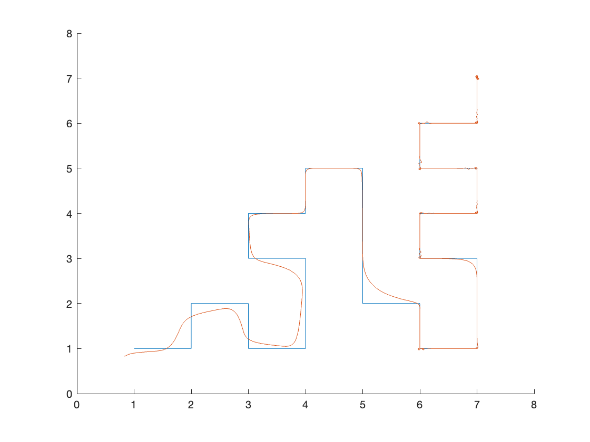
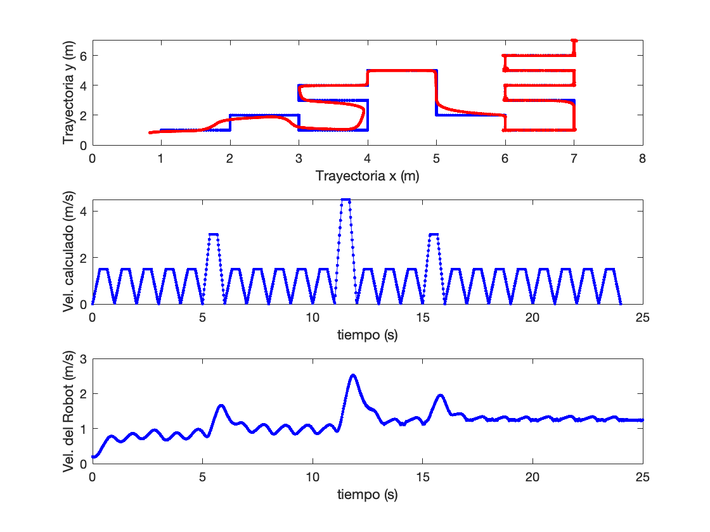
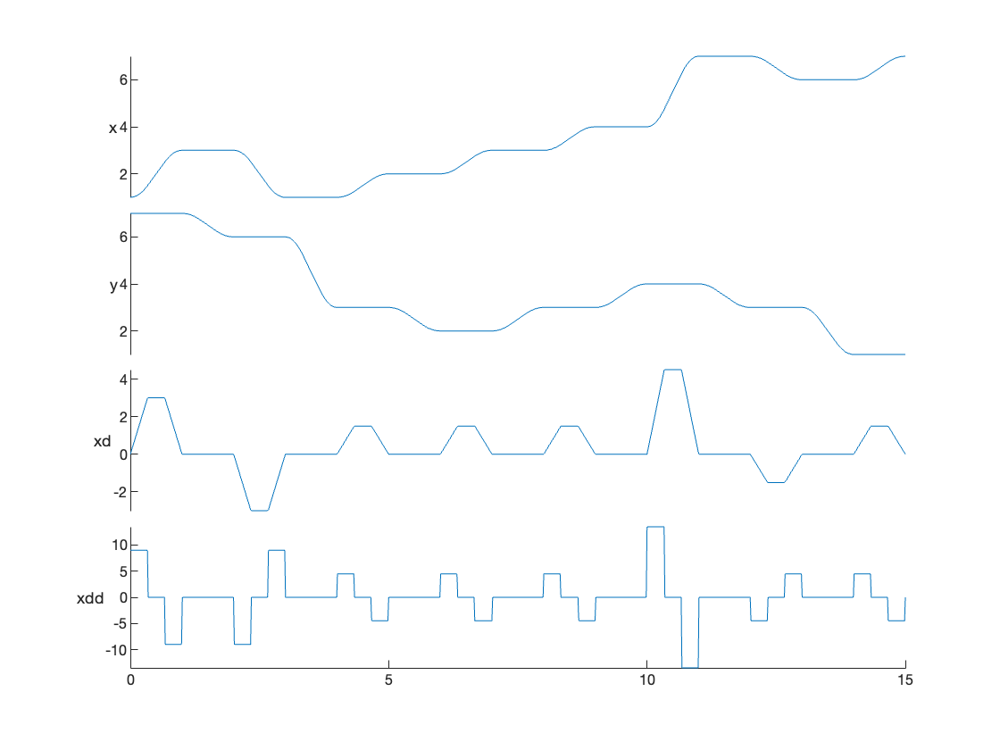

## Description

This lab project for the Introduction to Robotics course aims to apply knowledge related to the topics of "Time and Motion" and "Mobile Robots."


The lab project is divided into two parts. The first part involves designing a multi\-segment trajectory that will be used to program a mobile robot, following the "Car\-Like Vehicle" model discussed in class.

## Part 1. Design of a multi\-segment path  (8pts)

1.1 Load the figure called "Maze01" and display the map.

```matlab
close all
clf;
```

```matlabTextOutput
Error using load
Unable to find file or directory '.\Maze01.fig'.

Error in matlab.graphics.internal.figfile.FigFile/read (line 31)
hgDataVars = load(filename, '-mat', '-regexp', '^hg[M]');

Error in matlab.graphics.internal.figfile.FigFile

Error in loadFigure (line 31)
FF = matlab.graphics.internal.figfile.FigFile(fullpath);

Error in openfig>localOpenFigure (line 75)
    h = loadFigure(filename, visibleAction);

Error in openfig (line 40)
figOut = localOpenFigure(filename, reuse, visibleAction);
```

```matlab
openfig(fullfile(pwd, 'Lab2/Maze01.fig'));
hold on
```

1.2 Define a path to move the robot from the bottom\-left corner to the top\-right corner of the maze. Plot the path over the maze diagram.

```matlab
path = [1 1;2 1;2 2; 3 2;3 1;4 1;4 3; 3 3;3 4;...
    4 4;4 5;5 5;5 2;6 2;6 1;7 1;7 3;6 3;6 4;7 4;...
    7 5;6 5; 6 6;7 6;7 7];
plot(path(:,1),path(:,2))
```


1.3 Compute a trapezoidal trajectory for the previously defined path and visualize the variables: x, y, velocity, and acceleration in the x\-direction.

```matlab
Np = 1000;                 % Points quantity
tseg = 1;                  % EndTime by segment
[rows, cols] = size(path);
tt = rows*tseg;            % Total time
tsamp = tt/Np;             % Sampling time
figure(2)
[q,qd,qdd,t] = trapveltraj(path', Np,EndTime = tseg);
stackedplot(t,[q(1,:)' q(2,:)' qd(1,:)' qdd(1,:)'],"DisplayLabels",["x","y","xd","xdd"])
```


1.4 Plot the magnitude of the velocity profile vector for x and y, and calculate the average velocity.

```matlab
figure (3) 
subplot(2,1,1)
plot(q(1,:),q(2,:),"b.-")
subplot(2,1,2)
plot(t, vecnorm(qd,2,1),"b.-") % vecnorm calculates the magnitude of each x, y pair in the velocity profile.
```


Mean velocity:

```matlab
Vp_c = mean( vecnorm(qd,2,1))
```

*Result is 1.1655*

## Part 2. Make a robot follow the computed trajectory

The next step is to make the robot follow the computed trajectory.


2.1 Define `qT` as equal to the trajectory in `q`, and `ts` as the time vector. 

```matlab
qT = q';
ts = t';
```

2.2 Simulate the robot by invoking the file `sl_pursuit_lab2`.

```matlab
sl_pursuit_lab2
r = sim("sl_pursuit_lab2");
```

2.3 Plot the trajectory followed by the robot on Figure 1, along with its velocity profile, and compare it with the velocity profile calculated in section 1.4.

```matlab
qR = r.get("y")';
tR = r.get("tout")';
figure (1)
hold on
plot(qR(1,:), qR(2,:))
```



```matlab
figure (3)

subplot(3,1,1)
% Computed route in blue
plot(q(1,:),q(2,:),"b.-")
hold on
% Followed path by the robot in red
plot(qR(1,:),qR(2,:),"r.-")
ylabel("Trayectoria y (m)")
xlabel("Trayectoria x (m)")

% Computed velocity in blue
subplot(3,1,2)
plot(t, vecnorm(qd,2,1),"b.-")
ylabel("Vel. calculado (m/s)")
xlabel("tiempo (s)")

% Followed velocity profile in blue
subplot(3,1,3)
plot(tR,vecnorm(qR(4:5,:),2,1),"b.-")
ylabel("Vel. del Robot (m/s)")
xlabel("tiempo (s)")
Vp_robot = mean( vecnorm(qR(4:5,:),2,1))

Vp_robot/Vp_c  
```


*Vp\_robot = 1.1795*


*Vp\_robot/Vp\_c = 1.0120*

## Questionary
1.  What is the initial coordinate of the robot? **A/ The initial point is located at the ordered pair (1, 1).**
2. How similar is the velocity profile executed by the robot compared to the calculated velocity profile? This response is based on observations from their graphs. **A/ From the graph generated in Part 2, it is evident that the robot follows a smoothed velocity profile compared to the calculated trapezoidal profile. However, it can be observed that the valleys and peaks in both graphs correspond to each other, with notable differences in magnitude and shape, but not in behavior.**
3. Try to improve the robot's trajectory to make it as similar as possible to the calculated trajectory. To achieve this, the recommendation is to modify the PI values of the PI velocity controller. **A/ The current trajectory of the robot exhibits overdamped behavior, which is due to the high integral component of the controller relative to the proportional component. To reduce this smoothed behavior, it is necessary to increase the value of the proportional component. This adjustment allows the controller to reach the target value more quickly, resulting in a trajectory that more closely resembles the ideal one. Originally, the velocity controller has an integral component of 0.2 and a proportional component of 1. After several tests, it was observed that increasing the proportional component to 8 allowed for almost ideal trajectory tracking. Further increasing it to 16 yielded slightly better performance, leading to the selection of this value. The results are shown below.**


3.1 Create a new maze.

```matlab
L = 8;
map = mapMaze(2,1,'MapSize',[L L],'MapResolution',3);
clf
map.show
xticks([0:1:L])
yticks([0:1:L])
grid on
hold on
```

*The following maze has been created and stored as Maze02, therefore, the code above is no longer required.*


*To load it, the following code shall be used.*

```matlab
close all
clf;
openfig(fullfile(pwd, 'Lab2/Maze02.fig'));
hold on
```

3.2 Configure the robot to start at the position (x, y) = (1, 8), with a heading angle = $-\frac{\pi }{2}$ .


*To make this change, you need to modify the initial state of the robot's kinematic model in Simulink, as shown below.*


3.3 Design a trajectory that guides the robot from the top\-left corner to the bottom\-right corner along a path free of obstacles.

```matlab
path = [1 7;3 7;3 6;1 6;1 3;2 3;2 2;3 2;3 3;...
    4 3;4 4;7 4;7 3;6 3;6 1;7 1];
plot(path(:,1),path(:,2))
```


3.4 Configure the proportional constant P = 1 for the PI velocity controller.


*To achieve this, simply modify the PID controller for velocity in Simulink, as shown below.*


3.5 Run the simulation by following all the steps outlined in Parts 1 and 2.


*Compute a trapezoidal trajectory for the defined path, visualizing the variables x, y, velocity, and acceleration in the x\-direction using the following code:*

```matlab
Np = 1000;                 % Number of points
tseg = 1;                  % End time by segment
[rows, cols] = size(path);
tt = rows*tseg;            % Total time
tsamp = tt/Np;             % Sampling time
figure(2)
[q,qd,qdd,t] = trapveltraj(path',Np,EndTime=tseg);
stackedplot(t,[q(1,:)' q(2,:)' qd(1,:)' qdd(1,:)'],"DisplayLabels",["x","y","xd","xdd"])
```

  


*Plot the magnitude of the velocity profile vector (x,y)(x, y)(x,y) in Figure 3 and calculate the average velocity.*

```matlab
figure (3) 
subplot(2,1,1)
plot(q(1,:),q(2,:),"b.-")
subplot(2,1,2)
plot(t, vecnorm(qd,2,1),"b.-") %vecnorm calcula la magnitud de cada par x,y del perfil de velocidad
```


*Mean velocity:*

```matlab
Vp_c = mean( vecnorm(qd,2,1))
```

*Result is: 1.4652*


 *The next step is to program the robot with the calculated trajectory. Below, define* *`qT`* *as equal to the trajectory in* *`q`* *, and* *`ts`* *as the time vector.* 

```matlab
qT = q';
ts = t';
```

 *Next, simulate the robot by invoking the file* ***`sl_pursuit_lab2`****.*

```matlab
sl_pursuit_lab2
r = sim("sl_pursuit_lab2");
```

*Next, plot the trajectory followed by the robot on Figure 1, along with its velocity profile, and compare it with the velocity profile calculated in section 1.4.*

```matlab
qR = r.get("y")';
tR = r.get("tout")';
figure (1)
hold on
plot(qR(1,:),qR(2,:))
```


```matlab
figure (3)

subplot(3,1,1)
% Computed path in blue
plot(q(1,:),q(2,:),"b.-")
hold on

% Followed path in red
plot(qR(1,:),qR(2,:),"r.-")
ylabel("Trayectoria y (m)")
xlabel("Trayectoria x (m)")

% Computed velocity profile in blue
subplot(3,1,2)
plot(t, vecnorm(qd,2,1),"b.-")
ylabel("Vel. calculado (m/s)")
xlabel("tiempo (s)")

% Followed velocity profile in blue
subplot(3,1,3)
plot(tR,vecnorm(qR(4:5,:),2,1),"b.-")
ylabel("Vel. del Robot (m/s)")
xlabel("tiempo (s)")
Vp_robot = mean( vecnorm(qR(4:5,:),2,1))

Vp_robot/Vp_c  
```

*Vp\_robot = 1.3344*


*Vp\_robot/Vp\_c = 0.9107*


3.6 Try to achieve a reasonably accurate trajectory execution for the robot. Indicate the new value of P for the best result and plot your results.


*Following the approach of the first part of the project, given that the trajectory behavior is overdamped, the focus is primarily on a low proportional value of the controller. Therefore, the initial increments are made in powers of two to find a sufficiently good value in a few steps, ensuring a more precise trajectory.*


*By using this approach, it was determined that a proportional value of 8 improves the results enough to guarantee trajectory tracking without collisions with the maze walls, achieving nearly perfect turns at most of the turning points.*


3.7 What challenges did you encounter while conducting this lab?


*The main challenge I faced was determining where to modify the robot's initial pose, as I was very focused on the code and completely disconnected from the existence of the model in Simulink.*

